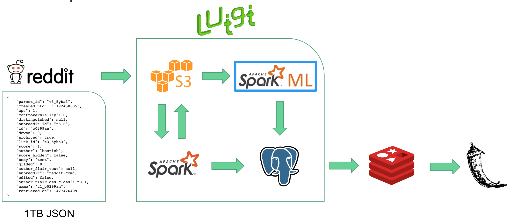

# /r/edditonomy
_a spark.ml architecture for developing taxonomies_

## Business Case
According to Alexa.com, Reddit is the 17th most active website globally. Given
Reddit's (sub)community-based structure, there are interesting patterns of
behavior that emerge in each individual community. 

The underlying structure or themes within a body of text is called a _taxonomy_.
This structure can be obtained by feeding tokenized raw text into a machine
learning model such as latent dirichlet allocation (LDA) that is able to
classify tokens into particular categories.

The main value in such a platform is being able to automatically extract topics
from these communities yielding highly desirable targeting abilities for ads and
a deeper understanding of specific verticals.

/r/edditonomy is a full-stack application that allows a user to explore
subreddits and look at the main themes or taxonomies that emerge in those
subcultures on a week-by-week basis

## Data

Reddit comments are available as bz2 compressed files through
[archive.org](https://archive.org) broken down by year from its inception in
2007 to 2015.

The volume of comments has increased over the years from ~100MBs/month in 2007
to ~30GBs/month, yielding approximately 1TB of uncompressed JSON data. This is
approximately 1.5B comments. The data is a list of documents containing key,
value pairs such as:

Key | Value Type
----| ----------
created_utc | int (utc)
id | str
score | int
author | str
body | str
subreddit | str
name | str

## Data Pipeline Architecture 
- Raw data stored on S3 broken down by year, month
- Data is pre-prcessed in Spark with intermediate results stored in S3
- A SparkML Pipeline consisting of a Tokenizer, StopWordsRemover, CountVectorizer, and LDA 
  is applied on a subreddit-by-week-by-week filtered Spark Dataframe, with results
  stored in PostgreSQL
- SparkML jobs are run using Luigi for the workflow manager
- Redis is used as a caching layer to reduce latency and load on the PostgreSQL database
- UI is served up using Flask

## Processing Workflow

The raw data is already batched into monthly blocks. Each block is read in from
S3 as a spark dataframe, irrelevant columns are dropped, and a simple
tokenization is applied to the 'body' column. This intermediate representation
of the data is written back to S3 using a similar partition scheme.

The tokenized comments are further prepared for LDA by aggregating the comments
from a dataframe filtered by subreddit and week. Topic classification is done
using a StopWordsRemover, CountVectorizer, and LDA pipeline. The output of LDA
is then made into JSON in prep for access via Flask. The results are stored in a
postgresql table with the schema `('subreddit', 'week', 'results')`

SparkMLib has an implementation of LDA that is able to use two different types
of optimization algorithms: expectation-maximization (EM) and online variational
Bayes (online). Here we employ only the 'online' algorithm, which is generally
more cost effective, but may require more iterations to yield good
classifications.

## Setup
Resource provisioning and cluster installation were done using the in-house
[Pegasus](https://github.com/InsightDataScience/pegasus) tool.

### Spark Cluster
`peg up spark-cluster` with 1 master, 6 workers  
`peg install spark-cluster [ssh, environment, aws, hadoop, spark]`  
`peg service spark-cluster spark start`  

### PostgreSQL Cluster
`peg up postgresdb-cluster` with 1 instance  
`peg install postgresdb-cluster [ssh, aws, environment]`  

PostgreSQL was installed via `apt`, and was set up following the Debian/Ubuntu
instructions from this repository
https://github.com/snowplow/snowplow/wiki/Setting-up-PostgreSQL .

### Redis/Flask Server
`peg up redis-cluster` with 1 master, 1 worker  
`peg install redis-cluster [ssh, environment, aws, redis]`  
`peg service redis-cluster redis start`  

The Flask app was served using nginx/gunicorn services from the same ec2
instance as the Redis server to decrease latency.

